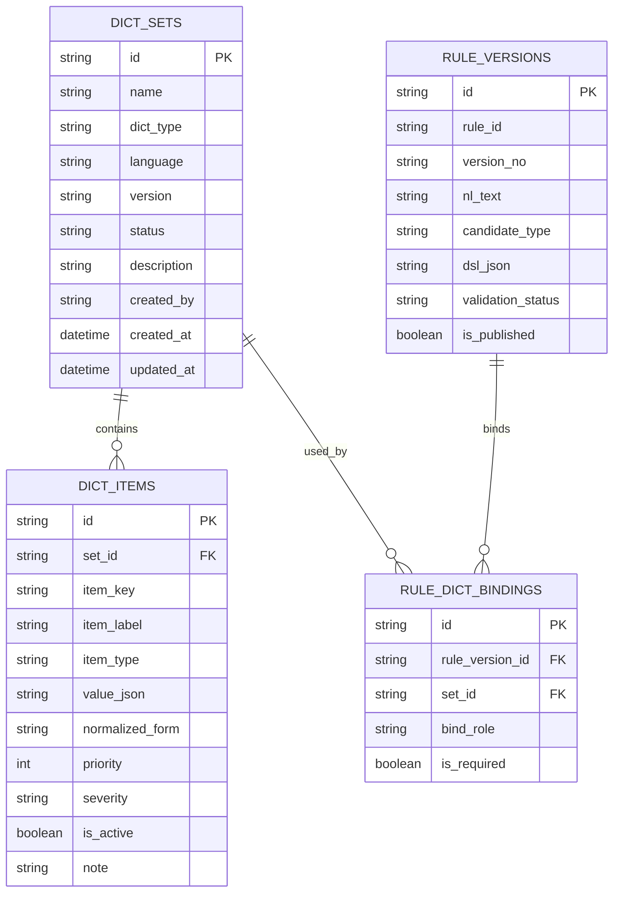
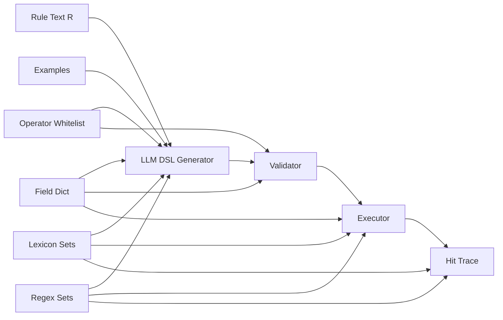
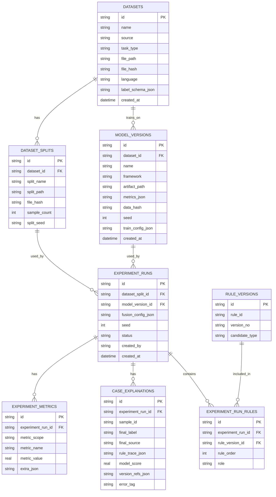
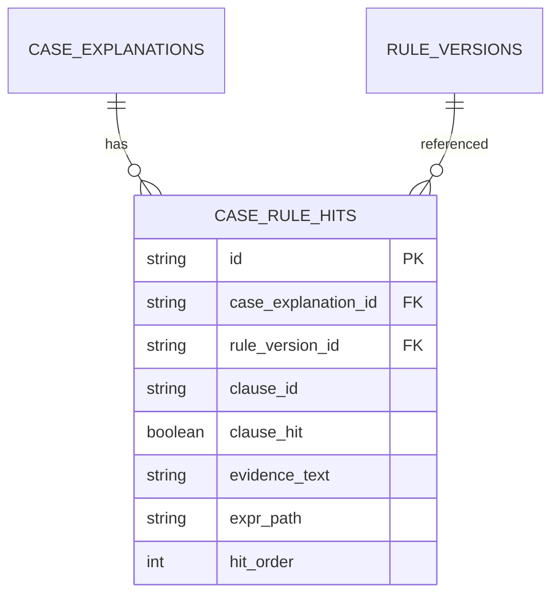

# 1. 先给结论：今天就落地，场景不要做大，直接收敛到“中文短文本/评论合规二分类”

两份报告里最稳定、最适合当天落地的方案，其实已经很清楚了：主场景用中文文本合规判定，数据优先选 ToxiCN，必要时后面再补 Jigsaw 做跨语言对照；系统链路按“规则文本 → DSL 生成 → 校验修复 → 执行 → 评价 → 规则组合 → BERT 基线 → 融合判定 → 样本解释”跑通即可。报告明确把 ToxiCN / Jigsaw、BERT 微调、规则优先+模型补位、以及 R/F/O/E 输入结构都定下来了，所以你现在最优策略不是再扩场景，而是把这个单场景做到完整闭环。   

我建议你今天的 MVP 直接定义为：

- **场景**：中文评论/短文本审核
- **任务**：二分类，`compliant` / `non_compliant`
- **主数据**：ToxiCN（先做中文）
- **规则覆盖范围**：只做“高确定性显式违规”，比如明确辱骂、明确威胁、掩码辱骂、命中次数阈值
- **模型补位范围**：阴阳怪气、语境攻击、弱冒犯、讽刺等难规则化样本
- **前端只做三页**：Rule Studio / Metrics Dashboard / Case Explorer
- **后端只做一条主链**：生成、校验、执行、评测、融合、解释

这样做和报告是一致的：规则负责“确定性拦截”，模型负责“语义补位”，不要反过来。

---

# 1.1 “规则 → DSL”里的“规则”到底是什么

这里的“规则”，在报告定义里就是 **R：规则文本（自然语言描述）**，它本质上是业务规则，不是训练样本，也不是“规则+样例”的混合体。报告里把输入拆成了四部分：`R` 是规则文本，`F` 是字段字典，`O` 是操作符白名单，`E` 是可选示例，用于 few-shot 学习。也就是说，**规则本体是自然语言描述，样例是辅助输入，不是规则本身**。 

你这里可以把一个规则对象拆成四层来理解：

## A. 规则本体（必须有）

这是要被翻译成 DSL 的业务描述，例如：

> 文本若包含明确威胁表达，如“弄死你”“杀了你”等，直接判不合规，高危。

或者：

> 文本若包含明确辱骂词，且出现次数达到 2 次及以上，判不合规。

这部分才是 `R`。

## B. 规则元数据（强烈建议有）

这部分不直接参与 DSL 逻辑，但要存起来做版本治理：

- rule_id
- rule_name
- scope
- severity
- owner
- 生效范围
- 版本号
- 创建时间

报告里也明确说规则库要包含版本、生效范围、责任人等元数据。

## C. 规则样例（建议有，但不是必须）

这就是 `E`。作用有两个：

- 给 LLM few-shot，帮助它理解这条规则的边界
- 给执行器和回归测试做 rule unit test

例如同一条“威胁表达”规则可以配：

- 正例：`我弄死你`
- 正例：`信不信我杀了你`
- 反例：`这本小说里写了“杀了你”这句话`
- 反例：`别老说“去死吧”这种台词`

这里最关键的一点是：**样例不是拿来定义规则的主来源，而是拿来收边界的辅助证据**。

## D. 规则候选实现（系统生成）

报告里明确说，同一条规则可以生成多个实现版本：`strict / loose / synonyms`，后续再通过评价和优化选最优版本。

所以一条规则的完整对象，建议你今天就这么落：

```json
{
  "rule_id": "R001",
  "rule_name": "明确威胁表达拦截",
  "nl_rule": "文本若出现明确威胁表达，如“弄死你”“杀了你”“打死你”等，直接判不合规，高危。",
  "scope": "comment_moderation",
  "severity": "high",
  "positive_examples": [
    "我弄死你",
    "信不信我打死你"
  ],
  "negative_examples": [
    "电影台词里出现了“杀了你”",
    "不要总说这种狠话"
  ],
  "candidate_types": ["strict", "loose", "synonyms"]
}
```

---

# 1.2 规则是泛泛写，还是要带具体样例

结论很直接：

- **规则文本要写成业务可读的自然语言规则**
- **每条规则最好配少量正/负样例**
- **样例不是必须进入 DSL，但非常建议进入 LLM prompt 和单测**
- **规则本身不要写成泛泛的“判断是否有害”**
- **规则要写成可被翻译的“条件化描述”**

也就是说，不要写：

> 判断这条文本是否具有攻击性。

要写成：

> 若文本包含明确威胁表达（如“弄死你”“杀了你”），直接判不合规。  
> 若文本包含高确定性辱骂词，判不合规。  
> 若文本包含辱骂词且命中次数≥2，判不合规。  
> 若文本存在谐音/符号插入的辱骂变体，判不合规。

因为 DSL 需要的是“可执行条件”，不是抽象目标。报告里 DSL 的最小设计就是 `field / op / value + expr`，天然要求规则文本具备条件结构。

---

# 1.3 规则和样例要不要先让 LLM 生成

我的建议是：

## 今天先不要让 LLM 生成“核心规则”

今天你要的是把系统骨架做完 80%，那规则源头应该尽量稳定、可控、可解释。  
所以：

- **核心规则**：你手写
- **规则样例**：优先从真实数据里抽
- **LLM 负责的事**：把规则翻成 DSL；必要时扩同义词、正则、strict/loose/synonyms 候选

这是最符合报告定位的。报告把 LLM 定位成“规则文本到结构化表达式的候选生成器”，不是“自己先发明一套规则”。

## 可以让 LLM 辅助生成的部分

可以，但限于下面三类：

### 1）扩写规则的候选实现

一条手写规则，让 LLM 分别生成：

- strict：高精度
- loose：高召回
- synonyms：加入变体/同义扩展

这正是报告里的设计。

### 2）扩词表

例如你先人工给出威胁词核心词表 10 个，LLM 可以建议另外 20 个候选，然后你人工筛掉风险词。

### 3）补单测样例

LLM 可以生成 hard negative / boundary case，用来压执行器和校验器，但不要混入 gold evaluation 数据。

## 不建议让 LLM 直接生成的部分

- 不建议让 LLM 生成核心业务规则全集
- 不建议让 LLM 生成评测 gold label
- 不建议让 LLM 生成最终实验数据

因为这样会把“规则源头”也变成黑盒，违背你整个项目想解决的可审计目标。

---

# 1.4 今天直接可用的“规则 + 数据”设计方案

## 场景

**中文评论审核**，只做二分类：

- `0 = compliant`
- `1 = non_compliant`

## 数据

先用 ToxiCN 做主实验集；后续如果你还有时间，再补 Jigsaw 做对照。报告里也是这么建议的。 

## 数据落表结构（今天就能建）

```text
sample_id
source_dataset
split
content
label_gold
lang
content_norm
content_len
insult_hit_count
threat_hit_count
```

其中：

- `content`：原始文本
- `content_norm`：归一化文本（全半角、大小写、空格、部分符号清洗后）
- `content_len`：长度
- `insult_hit_count`：命中辱骂词表次数
- `threat_hit_count`：命中威胁词表次数

这几个派生字段足够支撑第一版 DSL，不需要再加太多花字段。

## 今天第一版建议做 6 条规则，不要超过 10 条

下面这 6 条最稳：

| rule_id | 规则文本（R） | 说明 |
|---|---|---|
| R001 | 文本若出现明确威胁表达，如“弄死你”“杀了你”“打死你”等，直接判不合规，高危。 | 高精度 |
| R002 | 文本若包含高确定性辱骂词，如“傻逼”“脑残”“死全家”等，判不合规。 | 高精度 |
| R003 | 文本若存在辱骂词的符号插入/谐音变体，如“傻\*逼”“沙比”等，判不合规。 | regex / synonyms |
| R004 | 文本中辱骂词累计命中次数≥2，判不合规。 | count_gt |
| R005 | 文本若出现第二人称指向的侮辱表达，如“你+辱骂词”，判不合规。 | 减少中性误伤 |
| R006 | 对明显阴阳怪气、讽刺、弱攻击等规则难以高精度覆盖的文本，不走强规则，交给模型补位。 | 这是策略规则，不一定翻 DSL |

这里最关键的是：**规则只覆盖“显式、确定、可执行”的部分**；讽刺、上下文攻击、不带脏词的冒犯表达，直接留给模型。这和报告里的“规则确定性拦截 + 模型语义补位”完全一致。

## 每条规则都配 2 正例 + 2 反例

举例：

### R001 正例

- 我弄死你
- 信不信我打死你

### R001 反例

- 小说里写了“我杀了你”
- 不要总说这种狠话

### R002 正例

- 你就是个傻逼
- 你脑子有病吧，脑残

### R002 反例

- 这部片太垃圾了
- 垃圾分类要认真做

这一步非常重要，因为它能明显减少 DSL 生成时的语义跑偏。

---

# 1.5 今天的开发顺序

## 第一步：先把数据和派生字段做出来

- 导入 ToxiCN
- 做 train / val / test 划分
- 加 `content_norm`
- 加 `content_len`
- 跑词表命中，得到 `insult_hit_count / threat_hit_count`

## 第二步：先手写 6 条规则 + 样例

- 每条规则一段自然语言
- 每条规则配 2 正例 + 2 反例
- 每条规则配 severity 和 scope

## 第三步：把字段字典、操作符白名单、词表先固化

- field dict
- op whitelist
- insult lexicon
- threat lexicon
- regex set

## 第四步：接 LLM 生成 DSL

- 一次只生成一个 candidate_type
- 先做 strict
- 再做 loose / synonyms

## 第五步：做三级校验

- JSON parse
- schema / 字段 / op 合法性
- expr / 可执行性

## 第六步：先跑纯规则

- 统计 precision / recall / f1
- 看命中链路

## 第七步：再接 BERT baseline 和两阶段融合

这样你当天一定能跑出第一版结果。

---

# 2. 字典与词表对象：这块不能再抽象说，必须把它当“约束层 + 执行层 + 解释层”的核心中台

报告里只写了 `dictionary_lexicon（字段字典/词表）`，但真正落地时，这个对象不能只是一张“词表表”。它本质上是三个系统共享的契约层：

- **对 LLM 生成器**：限制它能用什么字段、什么操作符、什么词表
- **对执行器**：告诉它每个字段是什么类型、每个词表怎么命中、每个正则怎么跑
- **对解释器**：告诉它某个 clause 命中的是哪套词表、属于哪类风险

报告里把 `F` 定义为字段字典，把 `O` 定义为操作符白名单，并明确 DSL 生成输入需要它们；DSL 设计里又明确了 `contains_any / regex / len_gt / in_set / count_gt` 等能力；所以这一层实际上就是 DSL 的“运行时语言规范”。 

---

## 2.1 推荐的最小物理实现：3 张表就够



## 2.2 这 3 张表分别干什么

### `dict_sets`

这是“词典/字典集合”的头表。  
一条记录表示一套集合，比如：

- `field_dict_comment_v1`
- `op_whitelist_v1`
- `insult_core_lexicon_v1`
- `threat_core_lexicon_v1`
- `abuse_regex_v1`

关键字段含义：

| 字段 | 含义 |
|---|---|
| `id` | 集合主键 |
| `name` | 集合名 |
| `dict_type` | 类型：`field_dict` / `op_whitelist` / `lexicon` / `regex_set` / `synonym_set` |
| `language` | `zh` / `multi` |
| `version` | 版本号 |
| `status` | `draft` / `active` / `archived` |
| `description` | 用途说明 |
| `created_by` | 创建人 |

### `dict_items`

这是集合里的元素明细。  
例如在 `field_dict_comment_v1` 里，每个 item 就是一条字段定义；在 `insult_core_lexicon_v1` 里，每个 item 就是一个词条或一个归一化词簇。

关键字段含义：

| 字段 | 含义 |
|---|---|
| `set_id` | 属于哪套集合 |
| `item_key` | 程序键，比如 `content_norm`、`contains_any`、`傻逼` |
| `item_label` | 展示名 |
| `item_type` | 子类型，如 `field` / `operator` / `term` / `pattern` |
| `value_json` | 真正配置内容 |
| `normalized_form` | 归一化形式，适合词条 |
| `priority` | 优先级 |
| `severity` | 风险强度，适合词表/正则 |
| `is_active` | 是否启用 |

### `rule_dict_bindings`

这张表是关键。  
它说明某个 `rule_version` 绑定了哪些字典集，以及这些字典在这条规则里扮演什么角色。

`bind_role` 我建议固定四种：

- `generation`：LLM 生成时可见
- `validation`：校验器使用
- `execution`：执行器使用
- `explanation`：解释器使用

---

## 2.3 字典对象的运行时关系图



这图的意思是：

- `field_dict` 和 `op_whitelist` 先约束生成
- `lexicon / regex_set` 同时服务生成和执行
- 最终解释链路里，要能回指“命中了哪套词表/正则”

---

## 2.4 今天就能直接建的字典内容

### A. 字段字典 `field_dict_comment_v1`

| item_key | 类型 | 含义 | 允许 op |
|---|---|---|---|
| `content` | string | 原始文本 | `contains_any`, `regex` |
| `content_norm` | string | 归一化文本 | `contains_any`, `regex` |
| `content_len` | number | 文本长度 | `len_gt`, `len_lt` |
| `insult_hit_count` | number | 辱骂词命中次数 | `count_gt`, `>=`, `=`, `<=` |

### B. 操作符白名单 `op_whitelist_v1`

| op | 适用类型 | value 类型 | 说明 |
|---|---|---|---|
| `contains_any` | string | string[] | 命中任意词 |
| `regex` | string | string | 正则匹配 |
| `len_gt` | number | number | 长度大于 |
| `len_lt` | number | number | 长度小于 |
| `count_gt` | number | number | 次数阈值 |
| `in_set` | string/array | string[] | 集合命中 |
| `not_in_set` | string/array | string[] | 不在集合 |

### C. 词表 `insult_core_lexicon_v1`

建议你今天先人工放 20~50 个高确定性辱骂词，不要太多，不要含歧义大词。

### D. 词表 `threat_core_lexicon_v1`

放 10~20 个明确威胁表达。

### E. 正则集合 `abuse_regex_v1`

用于掩码辱骂、符号插入、谐音变体。

---

## 2.5 为什么字典层必须版本化

因为报告明确要求系统可复现、可回溯、版本可追踪。规则版本如果变了、模型版本如果变了，词表版本也必须能追溯，否则你最终解释链路会断。 

所以今天就把下面这个关系定死：

- **rule_version** 绑定 **field_dict_version**
- **rule_version** 绑定 **op_whitelist_version**
- **rule_version** 绑定 **lexicon_version**
- **experiment_run** 固化这些版本引用

---

# 3. 数据与模型对象、实验与解释对象：逐字段解释 + 关系图

这里我直接按“可落库版本”讲。  
有几个地方我会比前一版 PRD 更收紧：**多对多关系不要直接存 JSON 数组，改中间表**。这样 coding agent 今天就能直接建 SQLite。

---

## 3.1 数据与模型对象关系图



---

## 3.2 `datasets`

这张表是“数据集主对象”。

| 字段 | 类型 | 含义 | 约束/备注 |
|---|---|---|---|
| `id` | string | 主键 | PK |
| `name` | string | 数据集名，如 `ToxiCN_binary_v1` | 唯一 |
| `source` | string | 来源，如 `ToxiCN` / `Jigsaw` | 非空 |
| `task_type` | string | 任务类型，如 `binary_compliance` | 非空 |
| `file_path` | string | 原始数据文件路径 | 非空 |
| `file_hash` | string | 数据文件 hash | 非空，便于复现 |
| `language` | string | `zh` / `multi` | 建议非空 |
| `label_schema_json` | string(JSON) | 标签映射说明 | 如 toxic→non_compliant |
| `created_at` | datetime | 创建时间 | 非空 |

### 解释

报告强调实验必须固定数据版本、切分、seed、模型版本、规则版本、配置，`file_hash` 就是这里的核心。 

---

## 3.3 `dataset_splits`

这是固定切分对象。

| 字段 | 类型 | 含义 | 约束/备注 |
|---|---|---|---|
| `id` | string | 主键 | PK |
| `dataset_id` | string | 所属数据集 | FK → datasets.id |
| `split_name` | string | `train` / `val` / `test` | 非空 |
| `split_path` | string | 切分文件路径 | 非空 |
| `file_hash` | string | 切分文件 hash | 非空 |
| `sample_count` | int | 样本数 | 可空但建议有 |
| `split_seed` | string | 切分随机种子 | 建议存 |

### 解释

报告要求固定 `train/val/test`，且 `train/val` 调参、`test` 定型评一次。

---

## 3.4 `model_versions`

这是模型版本对象。

| 字段 | 类型 | 含义 | 约束/备注 |
|---|---|---|---|
| `id` | string | 主键 | PK |
| `dataset_id` | string | 训练所用数据集 | FK → datasets.id |
| `name` | string | 模型名，如 `bert_base_zh_v1` | 非空 |
| `framework` | string | `huggingface` / `pytorch` | 非空 |
| `artifact_path` | string | 模型产物目录 | 非空 |
| `metrics_json` | string(JSON) | 验证/测试指标 | 非空 |
| `data_hash` | string | 所训练数据版本 hash | 非空 |
| `seed` | int | 训练种子 | 非空 |
| `train_config_json` | string(JSON) | 训练参数 | 建议有 |
| `created_at` | datetime | 创建时间 | 非空 |

### 解释

报告里 BERT 被定义为“强可复现基线”，所以模型对象不能只存路径，必须带 `data_hash + seed + metrics`。 

---

## 3.5 `experiment_runs`

这是实验运行主对象。

| 字段 | 类型 | 含义 | 约束/备注 |
|---|---|---|---|
| `id` | string | 主键 | PK |
| `dataset_split_id` | string | 本次实验所用切分 | FK → dataset_splits.id |
| `model_version_id` | string | 所用模型版本 | FK → model_versions.id，可空（纯规则时） |
| `fusion_config_json` | string(JSON) | 融合配置 | 纯规则可空 |
| `seed` | int | 本次实验 seed | 非空 |
| `status` | string | `pending/running/success/failed` | 非空 |
| `created_by` | string | 发起人 | 建议非空 |
| `created_at` | datetime | 发起时间 | 非空 |

### 解释

这里不要把 `rule_version_ids` 直接塞 JSON。  
SQLite 能存，但后面查不舒服。改中间表更稳。

---

## 3.6 `experiment_run_rules`

这是实验与规则版本的关联表。

| 字段 | 类型 | 含义 | 约束/备注 |
|---|---|---|---|
| `id` | string | 主键 | PK |
| `experiment_run_id` | string | 所属实验 | FK → experiment_runs.id |
| `rule_version_id` | string | 参与实验的规则版本 | FK → rule_versions.id |
| `rule_order` | int | 规则顺序 | 便于组合过程展示 |
| `role` | string | `candidate/selected/final` | 用于优化过程 |

### 解释

这张表一加，你后面做贪心组合展示就非常顺。

---

## 3.7 `experiment_metrics`

这张表记录实验指标，不建议只存一整个 JSON，大盘和细项分开会更好查。

| 字段 | 类型 | 含义 | 约束/备注 |
|---|---|---|---|
| `id` | string | 主键 | PK |
| `experiment_run_id` | string | 所属实验 | FK → experiment_runs.id |
| `metric_scope` | string | `rule` / `rule_set` / `model` / `fusion` / `generation` | 非空 |
| `metric_name` | string | 如 `f1` / `precision` / `parseable_rate` | 非空 |
| `metric_value` | real | 指标值 | 非空 |
| `extra_json` | string(JSON) | 额外上下文 | 可空 |

### 解释

报告里的指标树分成生成质量、判定效果、治理与效率、可审计性四层，这张表就按这个树来落。

---

## 3.8 `case_explanations`

这是样本级解释对象，整个系统最关键的表之一。

| 字段 | 类型 | 含义 | 约束/备注 |
|---|---|---|---|
| `id` | string | 主键 | PK |
| `experiment_run_id` | string | 所属实验 | FK → experiment_runs.id |
| `sample_id` | string | 数据样本 id | 非空 |
| `final_label` | string | 最终预测标签 | 非空 |
| `final_source` | string | `rule` / `model` / `fusion` | 非空 |
| `rule_trace_json` | string(JSON) | 命中规则与 clause 轨迹 | 规则命中时必须有 |
| `model_score` | real | 模型概率 | 模型参与时建议有 |
| `version_refs_json` | string(JSON) | 规则/模型/词表版本引用 | 必须有 |
| `error_tag` | string | `fp/fn/tp/tn` 或人工标注错误类型 | 建议有 |

### 解释

报告明确要求系统能展示样本级命中规则、模型输出、最终决策，并支持误差分析与回溯。这个表就是 Case Explorer 的直接数据源。 

---

## 3.9 我建议再加一张 `case_rule_hits`

虽然报告没有明说这张表，但这是非常值得加的。



原因很简单：  
`rule_trace_json` 虽然能存，但调试和 SQL 检索不方便。你后面要做“查看某条规则在哪些案例里命中最多”“哪个 clause 误杀最多”，单独表非常方便。

---

# 4. 根据第 1 部分的结论，给你一版今天就能直接用的 LLM → DSL Prompt

这里我给两套：

- **A. 生成 Prompt**
- **B. 修复 Prompt**

你今天先把这两套接到 Node 里，就够用了。

---

## 4.1 生成 Prompt 的设计原则

根据两份报告，生成端必须受这几个约束：

1. 输入是 `规则文本 + 字段字典 + 操作符白名单 + 示例`
2. 输出必须是 JSON DSL
3. 只能使用允许字段和允许操作符
4. 同一条规则可以生成 `strict / loose / synonyms`
5. 失败后要能被 validator 诊断并修复 

所以 prompt 不能只说“把规则转成 JSON”，而要把：
- 字段类型
- 操作符类型约束
- 输出 schema
- candidate_type 行为差异
全部写清楚。

---

## 4.2 推荐的 DSL 输出结构（第一版）

```json
{
  "rule_id": "R001",
  "rule_name": "明确威胁表达拦截",
  "candidate_type": "strict",
  "clauses": [
    {
      "id": "c1",
      "field": "content_norm",
      "op": "contains_any",
      "value": ["弄死你", "杀了你", "打死你"]
    }
  ],
  "expr": "(c1)",
  "action": "block",
  "severity": "high",
  "rationale": "命中明确威胁表达"
}
```

这个结构是基于报告里的最小 DSL 扩一点工程字段，仍然完全在原项目范围内。报告的核心结构是 `field/op/value + expr + action + severity`。

---

## 4.3 生成 Prompt：System Prompt

```text
你是一个“规则编译器”，负责把中文文本审核规则翻译为可执行 DSL。
你的目标不是解释规则，而是输出严格符合要求的 JSON。

你必须遵守以下规则：

【任务目标】
将给定的“自然语言规则文本”转换为一条 JSON DSL 规则。

【输出要求】
1. 只输出 JSON，不要输出 markdown，不要输出解释，不要输出代码块。
2. 只能使用我提供的字段（field）和操作符（op）。
3. expr 只能引用 clauses 中已经定义的 id。
4. 每个 clause 必须包含 id、field、op、value。
5. action 只能取 block / review / pass 之一。
6. severity 只能取 high / medium / low 之一。
7. 如果规则无法可靠表达，也要尽量输出最接近且可执行的版本，不要返回空。
8. 不允许发明新的字段名、操作符、标签名。
9. 不允许把样例原文直接当作唯一规则；样例只能帮助你理解边界。
10. 优先生成“可执行 DSL”，不是自然语言总结。

【candidate_type 约束】
- strict：优先高精度，避免使用歧义词；宁可少召回，也不要明显误伤。
- loose：优先高召回，可以覆盖更多近义说法，但仍必须可执行。
- synonyms：在 strict 基础上加入同义词、变体写法、常见掩码/谐音表达。

【字段类型约束】
- string 类型字段：可用 contains_any、regex
- number 类型字段：可用 len_gt、len_lt、count_gt
- array/string 类型字段：可用 in_set、not_in_set

【逻辑表达式约束】
- expr 使用大写 AND / OR / NOT
- 允许括号
- 只能使用已定义 clauses 的 id，例如 (c1) OR (c2 AND c3)

【输出 schema】
{
  "rule_id": "string",
  "rule_name": "string",
  "candidate_type": "strict|loose|synonyms",
  "clauses": [
    {
      "id": "c1",
      "field": "string",
      "op": "string",
      "value": "string | number | string[]"
    }
  ],
  "expr": "string",
  "action": "block|review|pass",
  "severity": "high|medium|low",
  "rationale": "string"
}
```

---

## 4.4 生成 Prompt：User Prompt Template

你今天直接把下面这个模板做成字符串替换就能用。

```text
请把下面的审核规则翻译为 DSL。

【rule_id】
{{rule_id}}

【rule_name】
{{rule_name}}

【candidate_type】
{{candidate_type}}

【自然语言规则文本 R】
{{nl_rule}}

【字段字典 F】
{{field_dict_json}}

【操作符白名单 O】
{{op_whitelist_json}}

【可用词表摘要】
{{lexicon_summary_json}}

【正例 / 反例示例 E（可选）】
{{examples_json}}

【额外约束】
1. 优先使用 content_norm 做文本匹配。
2. 如果规则里涉及“出现次数”，优先使用 insult_hit_count / threat_hit_count 这类数值字段。
3. 对于高危威胁类规则，action=block，severity=high。
4. 如果词语存在明显歧义，strict 模式下不要直接纳入 value。
5. 不要输出空 clauses。
6. 不要输出注释。
7. 只返回一个 JSON 对象。
```

---

## 4.5 直接可用的 User Prompt 实例

```text
请把下面的审核规则翻译为 DSL。

【rule_id】
R001

【rule_name】
明确威胁表达拦截

【candidate_type】
strict

【自然语言规则文本 R】
文本若出现明确威胁表达，如“弄死你”“杀了你”“打死你”“砍死你”等，直接判不合规，高危。

【字段字典 F】
[
  {"field":"content","type":"string","allowed_ops":["contains_any","regex"]},
  {"field":"content_norm","type":"string","allowed_ops":["contains_any","regex"]},
  {"field":"content_len","type":"number","allowed_ops":["len_gt","len_lt"]},
  {"field":"insult_hit_count","type":"number","allowed_ops":["count_gt"]},
  {"field":"threat_hit_count","type":"number","allowed_ops":["count_gt"]}
]

【操作符白名单 O】
[
  {"op":"contains_any","field_types":["string"],"value_type":"string[]"},
  {"op":"regex","field_types":["string"],"value_type":"string"},
  {"op":"len_gt","field_types":["number"],"value_type":"number"},
  {"op":"len_lt","field_types":["number"],"value_type":"number"},
  {"op":"count_gt","field_types":["number"],"value_type":"number"},
  {"op":"in_set","field_types":["string","array"],"value_type":"string[]"},
  {"op":"not_in_set","field_types":["string","array"],"value_type":"string[]"}
]

【可用词表摘要】
{
  "threat_core_lexicon_v1":["弄死你","杀了你","打死你","砍死你","去死"],
  "insult_core_lexicon_v1":["傻逼","脑残","死全家","废物"]
}

【正例 / 反例示例 E（可选）】
{
  "positive":["我弄死你","信不信我打死你"],
  "negative":["小说台词里写了“杀了你”","不要总说这种狠话"]
}

【额外约束】
1. 优先使用 content_norm 做文本匹配。
2. 如果规则里涉及“出现次数”，优先使用 insult_hit_count / threat_hit_count 这类数值字段。
3. 对于高危威胁类规则，action=block，severity=high。
4. strict 模式下避免引入歧义表达。
5. 不要输出空 clauses。
6. 不要输出注释。
7. 只返回一个 JSON 对象。
```

---

## 4.6 修复 Prompt：System Prompt

这个是给 validator 失败后用的。

```text
你是一个 DSL 修复器。
你会收到一份不合法或不可执行的 DSL，以及校验器报错信息。
你的任务是修复 DSL，使其满足字段、操作符、结构和 expr 的约束。

修复时必须遵守：
1. 只输出修复后的 JSON，不输出解释。
2. 不能发明新的字段和操作符。
3. 必须根据错误信息最小修改。
4. 如果 expr 引用了未定义 clause，只能使用已存在的 clause id 重写 expr。
5. 如果字段不合法，替换为字段字典中最接近且类型匹配的字段。
6. 如果操作符不合法，替换为同类型且最接近语义的操作符。
7. 输出仍必须符合原 schema。
```

---

## 4.7 修复 Prompt：User Prompt Template

```text
请修复下面的 DSL。

【原始 DSL】
{{bad_dsl_json}}

【校验错误】
{{validator_error}}

【字段字典 F】
{{field_dict_json}}

【操作符白名单 O】
{{op_whitelist_json}}

【原始规则文本 R】
{{nl_rule}}

要求：
1. 只做必要修改。
2. 修复后必须可解析、可执行。
3. 只返回 JSON。
```

---

# 5. 你现在最该怎么做

## 先做的

1. 建 `datasets / dataset_splits / rules / rule_versions / dict_sets / dict_items / rule_dict_bindings`
2. 导入 ToxiCN 并加派生字段
3. 人工写 6 条规则，每条带 2 正例 + 2 反例
4. 建 `field_dict_comment_v1 / op_whitelist_v1 / insult_core_lexicon_v1 / threat_core_lexicon_v1`
5. 接生成 prompt 和修复 prompt
6. 实现 validator + executor
7. 跑 500~1000 条样本，看纯规则结果
8. 再接 BERT baseline 和两阶段融合

## 暂时不要做的

1. 不要一开始就做太多场景
2. 不要先做跨语言
3. 不要先做复杂加权融合
4. 不要先让 LLM 自动发明规则全集
5. 不要把数据库关系偷懒全塞 JSON

这样做最符合两份报告的边界，也最适合“今天就把项目落地 80%”的目标。 