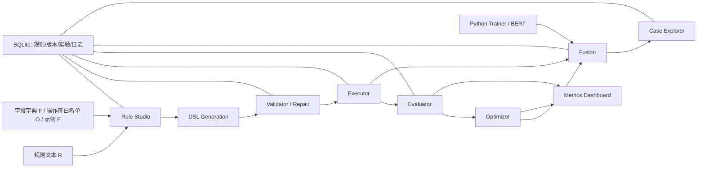
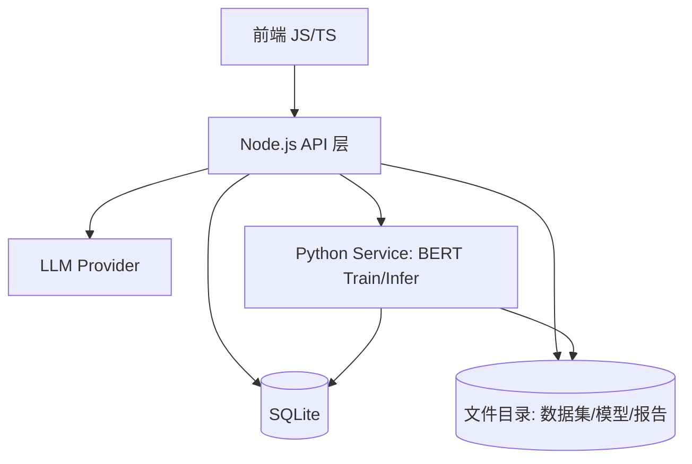

# RuleForge PRD：文本合规性判定规则的表达式生成与评价系统

## 1. 文档定位

本 PRD 不是论文摘要，也不是概念说明，而是一份可直接交给 coding agent 落地的系统设计文档。文档只在你提供的两版开题报告和配套图示范围内做工程化展开，不扩写报告之外的业务边界。系统目标明确：把“规则文本 → 可执行 DSL → 评价与优化 → 融合判定 → 可解释输出”做成一条完整、可开发、可测试、可复现的产品链路。项目名称为“文本合规性判定规则的表达式生成与评价方法”，答辩信息为崔真志、指导老师张志政、日期 2025/02/07；汇报主线是背景与意义、问题定义、目标设定、文献基础、技术方案、实验设计、总结展望，总时长 8 分钟。系统对应的研究目标链是 G1 规则文本到 DSL 生成，G2 表达式评价，G3 表达式组合优化与融合判定，G4 与纯 LLM / 纯模型路线做统一对比。 

## 2. 产品定义

### 2.1 产品要解决的核心问题

线上文本审核依赖大量自然语言规则，但业务规则从“写出来”到“跑起来”之间存在明显断层。业务同学写的是规范文本，系统执行需要的是结构化表达式。人工转译会带来成本、延迟和偏差。LLM 虽然能直接做审核，但在一致性、可审计性、可复现性上不满足合规系统要求。RuleForge 的产品定义因此非常清晰：它不是一个“让大模型直接判”的系统，而是一个把自然语言规则结构化、可执行化、版本化、可评测化、可解释化的规则治理系统。它允许模型参与，但模型的职责被限制在候选 DSL 生成和规则未覆盖场景下的语义补位，而不是替代整个审核链路。 

### 2.2 系统目标

系统必须同时满足五个目标。第一，能把自然语言规则生成成受字段字典、Schema 和操作符白名单约束的 DSL。第二，能把 DSL 做到“可执行”，而不是只做到“长得像 JSON”。第三，能用统一指标评价单条规则与规则集合，而不是只做主观判断。第四，能在效果与复杂度之间做可解释的规则组合优化。第五，能把规则与模型融合成可追溯的最终判定，并输出命中链路、版本号和理由。系统核心价值不是某个模块做得很强，而是全链路闭环。 

### 2.3 本期范围

本期系统范围包括：规则与版本管理、规则文本输入、字段字典与词表管理、LLM 生成 DSL、多候选版本管理、三级门禁校验、错误反馈修复、DSL 执行器、规则试跑、统一评测、规则组合优化、BERT 基线训练与版本登记、规则优先的级联融合、样本级解释、实验配置与结果固化、权限与审计日志。可选扩展但不纳入 MVP 的部分只有报告中明确提到的 beam 搜索和分数加权融合。 

## 3. 问题定义

### 3.1 五个关键难点

系统设计必须围绕五个难点展开，而不是分散做页面。生成难，指 NL→DSL 同时受结构合法、字段/操作符合法、语义尽量对齐三重约束。可执行难，指字段缺失、类型不匹配、逻辑歧义会让 DSL 无法执行或执行偏离预期。评价难，指 DSL 质量不能靠主观判断，必须同时量化正确性、覆盖、稳定和复杂度。组合难，指多规则之间会产生冲突、冗余，且搜索空间迅速膨胀。落地难，指合规系统必须输出完整证据链与版本信息，满足可解释、可追溯、可复现要求。核心洞察是，现有工作多是生成、评价、融合各做一段，缺少端到端闭环框架；本系统正是为补这个闭环而设计。

### 3.2 系统设计原则

系统设计遵守四条原则。第一，规则优先于模型，确定性逻辑先行，模型只在规则不覆盖或低置信场景补位。第二，版本优先于结果，任何输出必须能追溯到规则版本、模型版本、数据版本和实验配置。第三，执行优先于形式，DSL 的价值在于能跑、能解释、能复现，不在于生成文本看起来漂亮。第四，优化优先于堆叠，系统不鼓励“越多规则越好”，而鼓励“在复杂度可控前提下找到最优规则子集”。 

## 4. 用户角色与权限

### 4.1 角色定义

**规则运营 / 审核员**  
负责输入自然语言规则、查看 DSL 生成结果、执行校验与试跑、查看命中链路和样本级解释、决定是否发布某个规则版本。这个角色不需要理解模型训练细节，但要能够看懂 DSL、看懂失败原因、看懂命中证据。

**算法工程师**  
负责训练 BERT 基线、维护模型版本、触发统一实验、查看四条基线对比、调节融合配置。这个角色对规则系统的主要诉求不是编辑规则，而是保证实验可复现、对比公平、结果可分析。

**管理员**  
负责字典与词表治理、角色权限、审计日志、规则发布回滚控制、实验可访问性控制。管理员也负责确保样本脱敏与权限隔离。

### 4.2 权限边界

规则运营可以创建规则、生成 DSL、校验、试跑、提交发布申请、查看解释。算法工程师可以发起训练、登记模型、运行实验、读取指标与样本误差。管理员拥有发布、回滚、字典维护、权限配置、审计检索权限。任何写操作必须落审计日志。任何读样本详情的操作必须走权限校验和脱敏策略。

## 5. 总体架构

### 5.1 逻辑架构



这套逻辑架构严格对应报告中的技术路线：输入 R/F/O/E，经 DSL 生成，进入 Validate/Repair，再进入 Evaluate、Optimize、Fuse 和 Compare，最终形成可审计判定与对比实验。模块输出边界也来自报告：模块 A 输出 JSON DSL，模块 B 输出可执行 DSL 与失败类型日志，模块 C 输出受 K/λ 控制的最优规则子集，模块 D 输出命中链路、理由与版本号。 

### 5.2 部署架构



报告已经给出实现框架：前后端 JavaScript 完成业务闭环，SQLite 存储资产与实验，Python 负责训练产物；Node 统一对外提供 API，并输出融合判定与解释。本 PRD 保持这一架构，不额外引入消息队列、分布式任务系统或复杂中间件；原因不是不能加，而是本项目目标是可复现原型系统，而不是大规模生产系统。

### 5.3 页面信息架构

系统只保留三页，避免原型分散。

1. **Rule Studio**：规则列表、规则编辑、字段字典提示、DSL 预览、校验结果、试跑结果、发布回滚。  
2. **Metrics Dashboard**：数据集选择、实验列表、指标树、贪心组合过程、三线/四线对比、报告导出。  
3. **Case Explorer**：误判漏判筛选、单样本详情、命中链路、模型概率、来源标记、相关规则版本。  

三页设计与报告中的页面原型一一对应。

## 6. 核心对象模型

### 6.1 规则对象

规则对象分两层：`rule` 与 `rule_version`。`rule` 是业务规则主实体，描述规则主题与长期身份；`rule_version` 是某次具体文本、DSL、状态和元数据快照。产品上必须允许一条业务规则存在多个候选版本和多个发布版本历史。候选版本包括 strict、loose、synonyms 三类；正式版本状态包括 draft、validated、published、archived。

建议字段：

- `rules`
  - `id`
  - `code`
  - `name`
  - `owner_user_id`
  - `scope`
  - `created_at`
  - `updated_at`

- `rule_versions`
  - `id`
  - `rule_id`
  - `version_no`
  - `nl_text`
  - `candidate_type` (`strict|loose|synonyms|manual`)
  - `dsl_json`
  - `validation_status`
  - `validation_errors`
  - `is_published`
  - `created_by`
  - `created_at`

### 6.2 字典与词表对象

字典与词表是生成和执行的共同依赖。字段字典用于约束 LLM 生成时可用字段及字段类型；词表用于 contains_any、同义扩展等规则构造。建议统一存入 `dictionary_lexicon` 表，以 `dict_type` 区分 `field_dict`、`lexicon`、`op_whitelist`。

### 6.3 数据与模型对象

- `datasets`
  - `id`
  - `name`
  - `source`
  - `task_type`
  - `file_path`
  - `file_hash`

- `dataset_splits`
  - `id`
  - `dataset_id`
  - `split_name`
  - `split_path`
  - `file_hash`

- `model_versions`
  - `id`
  - `name`
  - `framework`
  - `artifact_path`
  - `metrics_json`
  - `data_hash`
  - `seed`
  - `created_at`

### 6.4 实验与解释对象

- `experiment_runs`
  - `id`
  - `dataset_id`
  - `split_config`
  - `rule_version_ids`
  - `model_version_id`
  - `fusion_config`
  - `seed`
  - `status`
  - `created_by`
  - `created_at`

- `experiment_metrics`
  - `id`
  - `experiment_run_id`
  - `metric_scope` (`rule|rule_set|model|fusion`)
  - `metrics_json`

- `case_explanations`
  - `id`
  - `experiment_run_id`
  - `sample_id`
  - `final_label`
  - `final_source`
  - `rule_trace_json`
  - `model_score`
  - `version_refs_json`

- `audit_logs`
  - `id`
  - `user_id`
  - `action`
  - `target_type`
  - `target_id`
  - `payload_json`
  - `created_at`

以上表设计直接对应报告给出的 SQLite 核心表。

## 7. 端到端业务流程

### 7.1 规则创建到发布

1. 规则运营在 Rule Studio 创建业务规则。  
2. 输入自然语言规则文本，选择字段字典、操作符白名单、示例模板。  
3. 点击“生成 DSL”，系统触发 LLM 生成 strict、loose、synonyms 候选版本。  
4. 系统对每个候选做三级门禁校验。  
5. 校验失败时自动触发错误反馈修复一次，并记录失败类型。  
6. 通过校验后，用户可以试跑数据样本，查看命中链路和初步指标。  
7. 用户选定一个版本发布；发布动作写审计日志；旧版本可回滚。  

这条流程必须成为产品默认主链路，不能依赖线下脚本。

### 7.2 实验运行

1. 算法工程师选择数据集及固定划分。  
2. 选择规则版本集、模型版本和融合配置。  
3. 运行纯规则、纯模型、纯 LLM、融合四条对比路线。  
4. 系统固化 `data_hash`、规则版本集、模型版本、阈值、seed。  
5. 输出 experiment_run、metrics、report、典型样本。  

实验流程不是单次调参脚本，而是可重跑、可追溯的产品对象。 

### 7.3 样本解释与回溯

1. 审核员在 Case Explorer 搜索某条样本。  
2. 系统展示最终判定、来源、规则版本或模型版本。  
3. 若来源为规则，展示命中 rule_id、clause_id、expr 路径与证据文本。  
4. 若来源为模型，展示模型版本、概率分数和触发原因“规则未命中/低置信后转模型”。  
5. 用户可以反查相关规则版本、实验 run 和模型版本。  

这条链路是系统“可审计”最核心的交付面。

## 8. 模块规格

## 8.1 Rule Studio

### 8.1.1 目标

Rule Studio 是规则资产入口。它必须让业务规则从文本进入系统，并能看到字段约束、生成结果、校验结果、试跑结果和版本状态。

### 8.1.2 前端结构

页面分三栏：

- 左栏：规则列表，显示规则名、当前发布版本、最近修改时间。
- 中栏：规则编辑区，输入自然语言规则文本，支持 metadata 字段如 scope、owner、severity 默认配置。
- 右栏：辅助区，显示字段字典、操作符白名单、示例模板和词表引用。
- 下方区域：DSL 预览、校验结果、试跑结果、发布/回滚按钮。

### 8.1.3 主要交互

- 创建规则
- 编辑规则文本
- 生成 DSL
- 查看多候选版本
- 校验
- 试跑
- 发布
- 回滚

### 8.1.4 状态机

```text
draft -> generated -> validated -> published -> archived
            |            |
            v            v
         repair_failed  rollback_target
```

### 8.1.5 验收标准

- 能创建规则与版本。
- 能查看 strict/loose/synonyms 候选。
- 能看到校验通过或失败。
- 能执行试跑并显示命中链路。
- 能发布与回滚，且日志一致。

## 8.2 DSL Generation

### 8.2.1 输入

- `R`: 规则文本
- `F`: 字段字典
- `O`: 操作符白名单
- `E`: 示例模板 / Schema

### 8.2.2 输出

- 单个或多个 DSL JSON 候选
- 每个候选附带 `candidate_type`

### 8.2.3 生成策略

生成模块只做“候选结构生成”，不承担最终正确性保证。默认通过 prompt 约束 DSL Schema、字段合法值、操作符枚举、示例格式，要求模型输出 JSON，不输出解释文本。对同一规则默认生成 strict、loose、synonyms 三个版本，供后续评价筛选。

### 8.2.4 Prompt 契约

建议 prompt 由四段构成：

1. 任务说明：把规则文本转成 DSL。  
2. 结构说明：给出 JSON Schema。  
3. 可用字段与操作符说明。  
4. few-shot 示例。  

### 8.2.5 DSL 目标结构

```json
{
  "rule_id": "R_001",
  "name": "rule_name",
  "clauses": [
    {"id": "c1", "field": "content", "op": "contains_any", "value": ["词1", "词2"]}
  ],
  "expr": "(c1)",
  "action": "block",
  "severity": "high"
}
```

这一定义来自报告中的 JSON DSL 设计，并扩展为 coding agent 可直接实现的对象模型。支持的原子操作只限于报告给出的 contains_any、regex、len_gt/len_lt、in_set/not_in_set、count_gt 及逻辑组合。

## 8.3 Validator / Repair

### 8.3.1 三级门禁

- **L1 JSON 可解析**：目标 ≥95%
- **L2 Schema 合法**：目标 ≥90%
- **L3 可执行解析**：目标 ≥85%

三级门禁是产品级指标，不只是论文指标。前端必须展示漏斗结果。

### 8.3.2 失败类型

系统至少记录以下错误类型：

- JSON 语法错误
- 字段不存在
- 类型不匹配
- 操作符非法
- 逻辑结构错误
- expr 引用未定义 clause
- 语义偏离（人工或规则单测发现）

报告中的典型失败分布为字段不存在 35%、类型不匹配 25%、操作符非法 20%、逻辑结构错误 15%、其他 5%。这些分布不作为硬编码逻辑，但作为默认分类体系和 Dashboard 展示维度。

### 8.3.3 修复机制

当任一门禁失败时，系统自动构造修复提示，将错误回喂 LLM 进行一次再生成。修复请求必须包含：

- 原始 DSL
- 错误类型
- 错误描述
- 允许使用的字段 / 操作符
- 修复约束

### 8.3.4 后端伪代码

```python
def validate_and_repair(dsl, field_dict, op_whitelist):
    result = validate_json(dsl)
    if not result.ok:
        return repair(dsl, result.error, field_dict, op_whitelist)

    result = validate_schema(dsl, field_dict, op_whitelist)
    if not result.ok:
        return repair(dsl, result.error, field_dict, op_whitelist)

    result = validate_executable(dsl)
    if not result.ok:
        return repair(dsl, result.error, field_dict, op_whitelist)

    return {"status": "passed", "dsl": dsl}
```

### 8.3.5 前端展示要求

- 显示当前门禁状态
- 显示错误类型与报错文本
- 显示修复前后差异
- 支持人工接受某个修复结果

报告中的示例“content 字段不存在，被修复为 text + contains”可直接作为单测用例。 

## 8.4 Executor

### 8.4.1 目标

把 DSL 真正跑在样本上，输出命中链路。执行器必须是可测、可解释、可独立复用模块。

### 8.4.2 执行步骤

1. 解析 clauses。
2. 将每个 clause 编译为 predicate。
3. 对样本逐条运行 predicate，得到 `c_i -> bool / score / evidence`。
4. 解析 expr，基于 clause 结果求整体命中。
5. 返回 rule hit、clause hit、expr path、action、severity。

### 8.4.3 伪代码

```python
def execute_rule(rule_dsl, sample):
    clause_results = {}
    evidences = {}
    for clause in rule_dsl["clauses"]:
        hit, evidence = eval_clause(clause, sample)
        clause_results[clause["id"]] = hit
        evidences[clause["id"]] = evidence

    final_hit = eval_expr(rule_dsl["expr"], clause_results)
    trace = build_trace(rule_dsl, clause_results, evidences, final_hit)
    return {
        "rule_id": rule_dsl["rule_id"],
        "final_hit": final_hit,
        "trace": trace,
        "action": rule_dsl.get("action"),
        "severity": rule_dsl.get("severity")
    }
```

### 8.4.4 单测要求

必须覆盖：

- contains_any
- regex
- len_gt / len_lt
- in_set / not_in_set
- count_gt
- AND / OR / NOT / 括号
- expr 引用不存在 clause 时的异常

### 8.4.5 输出要求

每次试跑至少返回：

- `rule_id`
- `sample_id`
- `clause_hits`
- `expr_path`
- `final_hit`
- `action`
- `evidence`

这是 Case Explorer 的数据源。

## 8.5 Evaluator

### 8.5.1 目标

Evaluator 负责统一评测协议。它不只算分类指标，还要评估生成质量、治理指标和复杂度。

### 8.5.2 指标树

**生成质量**
- Parseable Rate
- Schema Valid Rate
- Executable Rate
- Failure Type Distribution

**效果指标**
- Precision
- Recall
- F1
- Macro-F1 / Micro-F1

**治理指标**
- Coverage
- Conflict Rate
- Redundancy

**复杂度指标**
- Rule Count
- AST Node Count
- Avg Runtime

**可审计指标**
- Explanation Complete Rate
- Replayable Rate
- Version Traceability Rate

该指标树直接来自报告中的模块 B 评价设计和实验设计树状指标要求。

### 8.5.3 评测对象

Evaluator 必须支持 4 种评测对象：

- 单条 DSL
- 规则集合
- 纯模型
- 融合方案

### 8.5.4 输出

- 指标 JSON
- 实验摘要
- Top false positive / false negative 样本
- 可导出报告

## 8.6 Optimizer

### 8.6.1 目标

从多条规则、多候选版本中选择效果与复杂度折中的最优规则子集，而不是简单全部上线。

### 8.6.2 公式

`Utility = Metric - λ * Complexity`

默认 `Metric = Macro-F1`。  
`λ` 是复杂度惩罚强度。  
`K` 是规则集合上限。  

输出是效果-复杂度曲线上的 Pareto 折中规则集。

### 8.6.3 默认算法

使用贪心前向选择作为 baseline。beam 或局部替换只作为扩展，不进入 MVP。

### 8.6.4 伪代码

```python
def greedy_optimize(candidates, dataset, k, lambda_):
    selected = []
    best_utility = -1e9

    while len(selected) < k:
        best_rule = None
        best_score = best_utility

        for rule in candidates:
            if rule in selected:
                continue
            trial = selected + [rule]
            metric = evaluate_rule_set(trial, dataset)["macro_f1"]
            complexity = calc_complexity(trial)
            utility = metric - lambda_ * complexity
            if utility > best_score:
                best_score = utility
                best_rule = rule

        if best_rule is None:
            break

        selected.append(best_rule)
        best_utility = best_score

    return selected, best_utility
```

### 8.6.5 前端展示

Dashboard 必须可视化贪心过程：

- step1 加入哪条规则
- 当前 Macro-F1
- 当前 Complexity
- 当前 Utility
- 最终选中集合


## 8.7 Python Trainer

### 8.7.1 目标

提供强可复现的 BERT 文本分类基线，形成“纯模型路线”和融合路线的模型支撑。

### 8.7.2 输入

- 训练数据路径
- 验证数据路径
- 模型配置
- seed
- label mapping

### 8.7.3 输出

- 模型产物文件
- 训练配置文件
- 指标文件
- `model_version` 记录

### 8.7.4 Node 与 Python 协作方式

Node API 负责接收训练请求，落一条训练任务与输入配置；Python 脚本读任务、训练、输出模型与指标文件；Node 完成 `model_versions` 登记并为 Fusion 模块暴露推理入口。报告中已明确“Python 训练 BERT 并登记模型版本；Node 在融合时调用推理入口读取对应模型版本输出概率”，本 PRD 保持此职责边界。

### 8.7.5 训练基线要求

- 使用固定数据划分
- 固定 seed
- 输出概率
- 结果可重跑
- 模型版本可追溯

## 8.8 Fusion

### 8.8.1 主方案

主方案只实现报告推荐的级联两阶段：

- 阶段 1：规则命中高危规则，直接判不合规并输出解释。
- 阶段 2：规则未命中或低置信，交给 BERT 判定。

### 8.8.2 可选扩展

分数加权融合可做扩展，但不作为 MVP 交付条件。若实现，α 由验证集搜索确定。

### 8.8.3 输出结构

```json
{
  "sample_id": "xxx",
  "final_label": "non_compliant",
  "final_source": "rule",
  "rule_trace": {...},
  "model_version": null,
  "model_score": null,
  "version_refs": {
    "rule_version_ids": ["rv_12"],
    "experiment_run_id": "exp_7"
  }
}
```

若来源为模型，则 `final_source = model`，保留 `model_version` 和 `model_score`。

### 8.8.4 决策伪代码

```python
def fuse(sample, rule_set, model):
    rule_result = execute_rule_set(rule_set, sample)

    if rule_result.high_risk_hit:
        return build_final(rule_result=rule_result, source="rule")

    model_score = model.predict(sample["text"])
    return build_final(
        model_score=model_score,
        label=score_to_label(model_score),
        source="model",
        rule_result=rule_result
    )
```

### 8.8.5 解释原则

融合不能形成新的黑盒。无论最终结论来自规则还是模型，都必须说明为何规则链路结束于当前阶段，或为何转入模型阶段。

## 8.9 Case Explorer

### 8.9.1 目标

Case Explorer 负责把实验和规则输出还原为可读、可定位的样本级解释页面。

### 8.9.2 页面布局

- 顶部：搜索框、过滤器（全部 / 误判 / 漏判 / 来源）
- 左侧：文本原文或脱敏文本、真实标签、预测标签
- 中部：命中规则卡片、clause 命中详情、expr 路径
- 右侧：模型版本、模型概率、来源说明
- 底部：关联规则版本 / 实验 run / 类似样本

### 8.9.3 支持过滤

- false positive
- false negative
- source = rule/model
- rule_id
- severity
- dataset split

### 8.9.4 必要字段

- 文本
- GT label
- Pred label
- final_source
- rule_trace
- model_score
- version_refs

### 8.9.5 验收标准

抽检任意样本时，系统必须能回答五个问题：判了什么、为什么、哪条规则、哪个版本、模型是否介入。

## 8.10 Auth / Audit

### 8.10.1 目标

保证所有关键读写操作可鉴权、可检索、可回放。

### 8.10.2 审计范围

至少记录：

- 创建规则
- 编辑规则
- 生成 DSL
- 校验与修复
- 发布与回滚
- 发起训练
- 登记模型版本
- 运行实验
- 查看样本详情

### 8.10.3 权限规则

- 未授权用户不得查看原始样本文本
- 审核员不能管理用户权限
- 算法工程师不能直接发布业务规则
- 管理员可检索全部审计日志

### 8.10.4 脱敏规则

Case Explorer 默认展示脱敏文本，除非用户具备原文权限。脱敏策略需支持关键词、账号、链接等敏感片段遮罩。报告明确把接口鉴权、角色权限隔离、样本脱敏列为非功能需求。

## 9. API 规格

以下 API 名称直接沿用报告中的 Node JSON API。

## 9.1 规则 / DSL

### `POST /api/rules`
创建规则主对象。

请求：
```json
{
  "name": "辱骂与威胁拦截",
  "scope": "content_moderation",
  "owner_user_id": "u_1"
}
```

返回：
```json
{
  "rule_id": "r_1"
}
```

### `POST /api/rules/:ruleId/versions`
创建规则版本草稿。

### `POST /api/generate_dsl`
根据 `nl_text + F + O + E` 生成 DSL 候选。

请求：
```json
{
  "rule_version_id": "rv_1",
  "nl_text": "文本中不得包含辱骂词...",
  "field_dict_id": "fd_1",
  "op_whitelist_id": "op_1",
  "example_schema_id": "ex_1",
  "candidate_types": ["strict", "loose", "synonyms"]
}
```

返回：
```json
{
  "candidates": [
    {"candidate_type": "strict", "dsl_json": {...}},
    {"candidate_type": "loose", "dsl_json": {...}}
  ]
}
```

### `POST /api/validate_dsl`
执行三级门禁并返回修复结果。

### `POST /api/publish`
发布指定版本。

### `POST /api/rollback`
回滚到历史版本。  


## 9.2 执行 / 评测

### `POST /api/execute`
对规则或规则集执行试跑。

请求：
```json
{
  "rule_version_ids": ["rv_1", "rv_2"],
  "dataset_split_id": "ds_val"
}
```

返回：
```json
{
  "summary": {"hit_count": 120, "coverage": 0.31},
  "cases": [...]
}
```

### `POST /api/evaluate`
计算指标树。

### `POST /api/optimize_greedy`
返回贪心组合过程与最终规则集。

### `POST /api/experiments/run`
启动统一实验。

### `GET /api/experiments/:id`
获取实验详情、指标与报告路径。  


## 9.3 模型 / 融合

### `POST /api/model/train`
发起 BERT 训练任务。

### `GET /api/model/versions`
获取模型版本列表。

### `POST /api/fusion/run`
在指定实验配置下运行融合。  


## 9.4 解释分析

### `GET /api/cases`
分页获取样本详情列表，支持过滤。

### `GET /api/cases/:id`
获取单样本完整解释。  


## 10. 数据与 DSL 设计

### 10.1 DSL 约束

最小 DSL 必须支持两部分：

1. `clauses`: 原子条件，每条条件由 `field/op/value` 构成  
2. `expr`: 对 `clauses` 做 AND / OR / NOT / 括号组合  

支持操作符范围严格保持在报告范围内：

- `contains_any`
- `regex`
- `len_gt`
- `len_lt`
- `in_set`
- `not_in_set`
- `count_gt`

### 10.2 示例 DSL

```json
{
  "rule_id": "R_001",
  "name": "辱骂与威胁拦截 + 标题长度",
  "clauses": [
    {"id": "c1", "field": "content", "op": "contains_any", "value": ["傻X", "垃圾", "废物"]},
    {"id": "c2", "field": "content", "op": "regex", "value": "(弄死你|杀了你|让你消失)"},
    {"id": "c3", "field": "title_len", "op": "len_gt", "value": 30}
  ],
  "expr": "(c2) OR (c1) OR (c3)",
  "action": "block",
  "severity": "high"
}
```

### 10.3 解释输出

DSL 执行输出不允许只返回布尔值，必须返回 evidence 和 expr path，以支持“命中 c1 → expr 为真 → block”的样本级回溯。

## 11. 前端设计

### 11.1 路由

- `/rules`
- `/experiments`
- `/cases`

### 11.2 组件清单

**Rule Studio**
- `RuleList`
- `RuleEditor`
- `FieldDictPanel`
- `OpWhitelistPanel`
- `DslCandidateTabs`
- `ValidationPanel`
- `DryRunPanel`
- `PublishHistory`

**Metrics Dashboard**
- `ExperimentSelector`
- `MetricTree`
- `GreedyStepTable`
- `CompareChart`
- `ReportExportButton`

**Case Explorer**
- `CaseFilterBar`
- `CaseTextCard`
- `RuleTraceCard`
- `ModelScoreCard`
- `VersionRefPanel`

### 11.3 页面行为约束

- 所有按钮操作都必须有状态反馈
- 长任务必须显示 running / success / failed
- 校验结果必须可展开查看细节
- Case Explorer 必须支持从实验页跳转并带过滤条件
- 所有版本号点击后可跳到对应详情页

报告虽然没有强制框架，但已明确前端采用 JS/TS，并给出三页原型；本 PRD 定义的是页面与组件边界，不绑定具体前端框架。

## 12. 非功能需求

### 12.1 可复现性

每次实验必须固化以下字段：

- `data_hash`
- `dataset_split`
- `rule_version_ids`
- `model_version_id`
- `threshold`
- `seed`
- `fusion_config`

重复运行同一配置时，结果必须一致或差异可解释。

### 12.2 可解释性

每条判定必须返回以下最小解释字段之一：

- 规则命中路径：`rule_id + clause_id + expr_path + evidence`
- 模型概率：`model_version + score`

缺少版本号或缺少命中路径 / 模型概率的输出视为不合格。

### 12.3 性能

系统至少支持十万级文本的规则试跑与评测，记录总耗时与吞吐。此要求针对离线试跑与评测，不要求实时在线服务。

### 12.4 安全

- 接口鉴权
- 角色权限隔离
- 审计日志完整
- 样本展示支持脱敏

### 12.5 质量门禁

- JSON 可解析率 ≥95%
- Schema 合法率 ≥90%
- 可执行解析率 ≥85%

这三项必须在 Dashboard 中可视化呈现。

## 13. 数据与实验协议

### 13.1 数据集

系统实验基准使用公开数据集构建。中文优先使用 ToxiCN；多语言对照使用 Jigsaw；报告的答辩版还提到了 COLD 可作为中文补充。所有实验必须使用固定 train/val/test 划分，train/val 用于调参，test 只做定型评估。 

### 13.2 对比路线

必须同时支持以下四条路线：

1. 纯规则：DSL 直接执行
2. 纯模型：BERT 微调
3. 纯 LLM：端到端审核
4. 融合：规则优先 + 模型补位

这是系统实验设计的核心，不可删减。

### 13.3 消融实验

系统应允许配置以下消融：

- 去掉修复闭环
- 只保留 strict 或 loose 或 synonyms
- 不加复杂度惩罚
- 不做规则优化，直接全量规则
- 不做融合，只跑纯规则或纯模型

### 13.4 案例集

除公开标注数据集外，自建规则单测案例集必须覆盖：

- 关键词辱骂
- 威胁表达
- 变体写法
- 长度约束
- 引流广告

这部分已在报告的验证方法中明确。

## 14. 测试计划

### 14.1 功能测试

**规则流程**
- 创建规则
- 创建版本
- 发布
- 回滚
- 日志一致性

**DSL**
- 生成
- 校验
- 修复
- 校验通过
- 覆盖 JSON 错误、字段错误、expr 引用错误

**执行**
- 样本命中
- 命中链路输出
- 解释字段完整

**评测与优化**
- 指标正确
- 贪心过程可追溯
- 报告可导出

**训练与登记**
- Python 产物落盘
- Node 登记 model_version 成功

**融合与解释**
- 两阶段来源标注正确
- 模型与规则版本引用完整

这些测试项全部来自报告的验证方法。

### 14.2 非功能测试

- 相同配置重复运行一致性
- 十万级文本评测性能记录
- 权限校验
- 样本脱敏
- 审计日志检索
- 解释字段抽检通过率

## 15. MVP 范围与迭代计划

### 15.1 MVP

MVP 只交付以下模块：

- Rule Studio
- DSL Generation
- Validator / Repair
- Executor
- Evaluator
- Greedy Optimizer
- Python Trainer（BERT baseline）
- Fusion（仅级联两阶段）
- Case Explorer
- Auth / Audit

### 15.2 不进入 MVP 的扩展

- Beam 搜索
- 分数加权融合
- 更复杂的弱监督建模
- 多语言生产化能力
- 实时在线审核服务

这些内容报告中均作为扩展或对照，不应挤占主链路。

### 15.3 里程碑

**M1：生成闭环**  
完成 DSL v0、解析器、执行器、LLM 生成、校验修复、规则试跑。

**M2：三线对比与组合**  
完成 BERT baseline、规则评测、贪心优化、纯规则/纯模型/融合对比实验。

**M3：融合与可审计输出**  
完成原型系统三页、Case Explorer、日志、版本追踪、报告导出、系统演示。  

报告给出了更细的日期安排：2026.01.26—2026.02.25 完成 DSL 解析、LLM 生成与贪心 baseline；2026.02.26—2026.04.10 完成 BERT baseline、级联融合和三线对比；2026.04.11—2026.05.20 完成原型系统与扩展实验。

## 16. 风险与应对

### 16.1 规则歧义

同一规则可能存在 strict、loose、synonyms 多种实现，不能假设存在唯一正确 DSL。系统通过多候选生成 + 统一评测解决，而不是强行选一个答案。

### 16.2 LLM 不稳定

LLM 可能输出 JSON/Schema 不合法、字段不在白名单、expr 不可解析。系统通过三级门禁和修复闭环兜底。

### 16.3 规则组合搜索空间大

MVP 采用贪心前向选择，不做复杂搜索；复杂方法作为扩展。

### 16.4 融合再黑盒

系统主方案只采用级联两阶段，明确规则与模型职责边界，避免把融合做成新的黑盒。

### 16.5 公开数据与真实场景贴合度有限

系统使用公开数据集做可复现实验，同时补充案例集做规则单测与解释一致性检查。

## 17. coding agent 交付建议目录

为方便直接编码，建议把本 PRD 落成以下仓库文件，但本 PRD 本身已足够单独开发：

```text
/docs/prd.md
/docs/api-contract.md
/docs/dsl-schema.json
/docs/prompt-template.md
/docs/evaluation-protocol.md
/backend/node-api/*
/backend/python-trainer/*
/frontend/*
/db/schema.sql
/tests/rule_cases/*
```

其中必须先落地的不是页面，而是 `dsl-schema.json`、`schema.sql`、`/api/generate_dsl`、`/api/validate_dsl`、执行器与评测器。原因很简单：没有 DSL 契约和执行闭环，整套系统无从成立。整体开发顺序应是“数据结构和 DSL → 执行与校验 → API → 实验 → 页面”，而不是反过来。这个顺序与报告中的里程碑和技术路线一致。 

## 18. 最终验收标准

系统验收不是“页面能打开”，而是以下条件同时成立：

1. 能从自然语言规则生成 DSL 候选。
2. 能完成三级门禁校验和错误反馈修复。
3. 能对样本输出命中链路。
4. 能计算统一指标树。
5. 能跑通贪心规则组合。
6. 能完成 BERT baseline 训练与登记。
7. 能实现规则优先的两阶段融合。
8. 能支持纯规则 / 纯模型 / 纯 LLM / 融合四路线对比。
9. 任意样本均可回溯到规则版本或模型版本。
10. 关键操作均有审计日志。
11. 十万级文本试跑和评测可完成并记录性能。

达到以上 11 条，RuleForge 才算完成了“从规则文本到可审计判定”的闭环系统目标。 